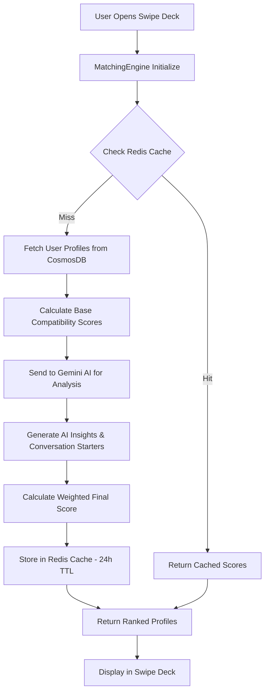

# VibeMatch Algorithm Technical Analysis

## Overview

VibeMatch employs a sophisticated multi-layered AI-powered matching algorithm designed to create meaningful romantic connections through advanced personality compatibility analysis, behavioral pattern recognition, and real-time learning systems.

## Core Algorithm Architecture

### 1. Weighted Scoring System

The matching algorithm uses a three-component weighted scoring system:

```python
def calculate_match_score(user_a, user_b):
    personality_score = calculate_personality_compatibility(user_a.personality, user_b.personality)
    interest_score = calculate_interest_overlap(user_a.interests, user_b.interests)
    behavior_score = calculate_behavioral_similarity(user_a.actions, user_b.actions)

    # Weighted combination
    final_score = (
        personality_score * 0.5 +    # 50% weight - Primary compatibility factor
        interest_score * 0.3 +       # 30% weight - Shared interests/activities
        behavior_score * 0.2         # 20% weight - Behavioral patterns
    )

    return min(max(final_score, 0), 100)  # Clamp to 0-100%
```

### 2. Component Analysis

#### Personality Compatibility (50% Weight)

- **Technology**: Google Gemini AI for advanced psychological analysis
- **Data Sources**:
  - MBTI/Big Five personality assessments
  - Communication style preferences
  - Relationship approach indicators
  - Emotional intelligence metrics
- **Processing**: Deep learning analysis of personality trait interactions
- **Output**: Compatibility score with detailed relationship dynamics insights

#### Interest Overlap (30% Weight)

- **Technology**: Mathematical similarity matching with ML enhancement
- **Data Sources**:
  - User-selected interests and hobbies
  - Activity preferences
  - Lifestyle choices
  - Entertainment preferences
- **Processing**: Jaccard similarity coefficient with weighted importance
- **Output**: Interest alignment score with shared activity recommendations

#### Behavioral Patterns (20% Weight)

- **Technology**: Machine learning pattern recognition
- **Data Sources**:
  - Swiping patterns and preferences
  - Message response rates and timing
  - Profile interaction depth
  - Date success metrics
- **Processing**: Continuous learning from user feedback loops
- **Output**: Behavioral compatibility prediction

## Technical Implementation

### Real-Time Processing Pipeline



### Core Services Architecture

#### MatchingAIService Class

```javascript
class MatchingAIService {
  constructor() {
    this.geminiClient = new GoogleGenerativeAI(process.env.GEMINI_API_KEY);
    this.redis = new Redis(process.env.REDIS_URL);
    this.cosmosDB = new CosmosClient(process.env.COSMOS_CONNECTION);
    this.model = this.geminiClient.getGenerativeModel({ model: "gemini-pro" });
  }

  async calculateAdvancedCompatibility(userA, userB) {
    // Multi-step compatibility calculation with AI enhancement
    // Performance target: <500ms per match pair
  }

  async calculatePersonalityCompatibility(personalityA, personalityB) {
    // Gemini AI-powered deep personality analysis
    // Includes relationship dynamics prediction
  }

  calculateInterestCompatibility(interestsA, interestsB) {
    // Mathematical similarity with weighted preferences
  }

  async calculateBehavioralCompatibility(userIdA, userIdB) {
    // ML-based behavioral pattern analysis
  }
}
```

## Performance Specifications

### Speed Requirements

- **Compatibility Calculation**: <500ms per match pair
- **Profile Deck Loading**: <2 seconds for 10 profiles
- **Real-time Updates**: <100ms for swipe feedback
- **Cache Hit Rate**: >85% for returning users

### Scalability Metrics

- **Concurrent Users**: 10,000+ simultaneous matching operations
- **Daily Calculations**: 1M+ compatibility assessments
- **Database Queries**: Optimized with Redis caching layer
- **API Rate Limits**: Gemini AI integration within Google quotas

## Data Storage & Caching Strategy

### Redis Cache Architecture

```yaml
Cache Keys:
  - compat_{userA_id}_{userB_id}: 24h TTL
  - personality_compat_{typeA}_{typeB}: 24h TTL
  - user_preferences_{user_id}: 1h TTL
  - behavioral_patterns_{user_id}: 12h TTL

Cache Hit Optimization:
  - Pre-compute high-probability matches
  - Batch calculate personality type combinations
  - Store frequently accessed user data
```

### CosmosDB Schema

```json
{
  "users": {
    "id": "string",
    "personality_profile": {
      "type": "string",
      "trait_scores": "object",
      "communication_style": "string",
      "relationship_approach": "string"
    },
    "interests": ["array"],
    "behavioral_data": {
      "swipe_patterns": "object",
      "interaction_metrics": "object",
      "success_indicators": "object"
    }
  },
  "compatibility_scores": {
    "user_pair": "string",
    "scores": "object",
    "ai_insights": "object",
    "calculated_at": "datetime"
  }
}
```

## AI Integration Details

### Gemini AI Implementation

#### Personality Analysis Prompt Structure

```javascript
const personalityAnalysisPrompt = `
You are a relationship psychology expert. Analyze compatibility between:

PERSON A: ${personalityA}
PERSON B: ${personalityB}

Provide analysis including:
- Communication compatibility (0-1 score)
- Emotional compatibility (0-1 score)  
- Lifestyle compatibility (0-1 score)
- Conflict resolution potential (0-1 score)
- Long-term relationship potential (0-1 score)

Return structured JSON with detailed insights.
`;
```

#### Response Processing

- **Temperature**: 0.3 for consistent psychological analysis
- **Max Tokens**: 1000 for detailed insights
- **Error Handling**: Fallback to mathematical compatibility
- **Rate Limiting**: Intelligent batching and caching

### Machine Learning Components

#### Behavioral Pattern Recognition

```python
class BehavioralAnalyzer:
    def analyze_swipe_patterns(self, user_history):
        # Pattern recognition for user preferences
        # Identifies: preferred age ranges, personality types, interests
        # Returns: preference vector for matching optimization

    def predict_interaction_success(self, user_pair, context):
        # ML model predicting conversation/date success
        # Features: compatibility scores, timing, user activity
        # Returns: success probability with confidence interval
```

## Algorithm Learning & Optimization

### Continuous Learning Loop

1. **Data Collection**: User interactions, feedback, success metrics
2. **Pattern Analysis**: ML identification of successful match characteristics
3. **Model Updates**: Nightly batch processing for algorithm refinement
4. **A/B Testing**: Algorithm variant testing with statistical significance
5. **Performance Monitoring**: Real-time metrics and alerting

### Success Metrics Tracking

- **Match Success Rate**: Percentage leading to conversations
- **Conversation Quality**: Message exchange depth and duration
- **Date Conversion**: Matches progressing to in-person meetings
- **Relationship Success**: Long-term relationship formation rates

## Profile Serving Logic

### Deck Population Algorithm

```javascript
async function populateSwipeDeck(userId, deckSize = 10) {
  // 1. Get user preferences and filters
  const userProfile = await getUserProfile(userId);

  // 2. Query candidate pool with basic filters
  const candidates = await getCandidates(userProfile.filters);

  // 3. Calculate compatibility scores for all candidates
  const scoredCandidates = await Promise.all(
    candidates.map((candidate) =>
      calculateAdvancedCompatibility(userProfile, candidate)
    )
  );

  // 4. Apply ranking algorithm
  const rankedProfiles = rankProfiles(scoredCandidates, userProfile);

  // 5. Apply diversity and freshness factors
  const optimizedDeck = optimizeDeckDiversity(rankedProfiles);

  return optimizedDeck.slice(0, deckSize);
}
```

### Ranking Factors

1. **Compatibility Score** (70% weight): Primary matching algorithm output
2. **Geographic Proximity** (15% weight): Distance-based preferences
3. **Activity Recency** (10% weight): Recently active users prioritized
4. **Mutual Connections** (5% weight): Shared friends/communities bonus

### Deck Refresh Strategy

- **Free Users**: 3 refreshes per session, 24-hour cooldown
- **Premium Users**: Unlimited refreshes with expanded candidate pool
- **Smart Refresh**: Introduces 30% new profiles, maintains 70% high-compatibility matches
- **Diversity Injection**: Ensures variety in personality types and interests

## Error Handling & Reliability

### Fallback Mechanisms

1. **AI Service Failure**: Mathematical compatibility calculation backup
2. **Cache Miss**: Direct database query with performance monitoring
3. **Database Timeout**: Cached profile serving with degraded matching
4. **Rate Limiting**: Intelligent queuing and batch processing

### Monitoring & Alerts

- **Response Time**: P95 latency under 500ms
- **Error Rate**: <1% matching calculation failures
- **Cache Performance**: >85% hit rate maintenance
- **AI Service Health**: Gemini API status monitoring

## Security & Privacy

### Data Protection

- **Encryption**: All personality and behavioral data encrypted at rest
- **Access Control**: Role-based access to sensitive matching data
- **Anonymization**: User identifiers hashed in compatibility calculations
- **Retention**: Behavioral data auto-deletion after 365 days

### Algorithm Transparency

- **Explainable AI**: Compatibility score breakdowns available to users
- **Bias Detection**: Regular audits for algorithmic fairness
- **User Control**: Preference adjustments affecting algorithm behavior

## Future Enhancements

### Planned Algorithm Improvements

1. **Video Analysis**: Facial expression and body language compatibility
2. **Voice Compatibility**: Speech pattern and tone analysis
3. **Social Graph Analysis**: Extended network compatibility assessment
4. **Temporal Patterns**: Optimal matching timing based on user lifecycle
5. **Multi-Modal Learning**: Integration of text, image, and behavioral signals

### Technical Roadmap

- **Q2 2024**: Enhanced behavioral pattern recognition
- **Q3 2024**: Real-time learning pipeline implementation
- **Q4 2024**: Video-based compatibility features
- **Q1 2025**: Advanced social graph integration

---

_Last Updated: December 2024_
_Version: 1.0_
