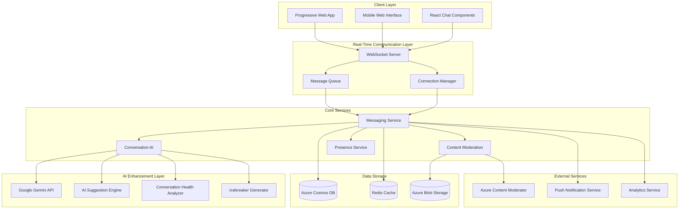

# VibeMatch Messaging Service Technical Analysis

## Executive Summary

The VibeMatch Messaging Service is a sophisticated real-time communication platform that enables matched users to connect through AI-enhanced conversations. Built on WebSocket technology with advanced AI integration, the system provides instant messaging, intelligent conversation assistance, and comprehensive safety features while maintaining enterprise-grade performance and scalability.

## System Architecture Overview

### High-Level Architecture



### Core Technical Components

#### 1. WebSocket Infrastructure
```yaml
Technology Stack:
  Server: Node.js with Socket.io
  Protocol: WebSocket with fallback to long-polling
  Load Balancing: Redis adapter for horizontal scaling
  Connection Management: Automatic reconnection with exponential backoff

Performance Specifications:
  Concurrent Connections: 100,000+ simultaneous users
  Message Latency: <500ms end-to-end delivery
  Connection Reliability: 99.9% uptime target
  Reconnection Time: <2 seconds on network recovery
```

#### 2. Message Processing Pipeline
```javascript
// Message Processing Architecture
class MessagingService {
  async processMessage(messageData) {
    const pipeline = [
      this.validateMessage,
      this.contentModeration,
      this.aiEnhancement,
      this.persistMessage,
      this.routeMessage,
      this.updateAnalytics
    ];
    
    return await this.executePipeline(pipeline, messageData);
  }
  
  async executePipeline(pipeline, data) {
    for (const step of pipeline) {
      data = await step(data);
      if (data.blocked) return data;
    }
    return data;
  }
}
```

## Detailed Component Analysis

### 1. Real-Time Communication System

#### WebSocket Server Implementation
```javascript
// WebSocket Server Configuration
const io = require('socket.io')(server, {
  cors: {
    origin: process.env.ALLOWED_ORIGINS,
    methods: ["GET", "POST"]
  },
  adapter: require('socket.io-redis')({
    host: process.env.REDIS_HOST,
    port: process.env.REDIS_PORT
  }),
  transports: ['websocket', 'polling'],
  pingTimeout: 60000,
  pingInterval: 25000
});

// Connection Management
io.use(async (socket, next) => {
  try {
    const token = socket.handshake.auth.token;
    const user = await verifyJWTToken(token);
    socket.userId = user.id;
    socket.userProfile = user;
    next();
  } catch (error) {
    next(new Error('Authentication failed'));
  }
});

// Message Handling
io.on('connection', (socket) => {
  console.log(`User ${socket.userId} connected`);
  
  // Join user-specific room for targeted messaging
  socket.join(`user_${socket.userId}`);
  
  // Update presence status
  updateUserPresence(socket.userId, 'online');
  
  // Handle message sending
  socket.on('send_message', async (data) => {
    await handleMessageSend(socket, data);
  });
  
  // Handle typing indicators
  socket.on('typing_start', (data) => {
    socket.to(`conversation_${data.conversationId}`).emit('user_typing', {
      userId: socket.userId,
      userName: socket.userProfile.displayName
    });
  });
  
  // Handle disconnection
  socket.on('disconnect', () => {
    updateUserPresence(socket.userId, 'offline');
  });
});
```

#### Message Routing and Delivery
```yaml
Routing Strategy:
  - Point-to-point delivery for direct messages
  - Room-based broadcasting for group features
  - Presence-aware delivery with offline queuing
  - Priority routing for system messages

Delivery Guarantees:
  - At-least-once delivery for all messages
  - Duplicate detection and deduplication
  - Ordered delivery within conversations
  - Reliable delivery confirmation
```

### 2. AI-Powered Conversation Enhancement

#### Conversation AI Service
```javascript
class ConversationAIService {
  constructor() {
    this.geminiClient = new GoogleGenerativeAI(process.env.GEMINI_API_KEY);
    this.model = this.geminiClient.getGenerativeModel({ model: 'gemini-pro' });
    this.redis = new Redis(process.env.REDIS_URL);
  }
  
  async generateIcebreakers(userA, userB, matchInsights) {
    const cacheKey = `icebreakers_${userA.id}_${userB.id}`;
    const cached = await this.redis.get(cacheKey);
    if (cached) return JSON.parse(cached);
    
    const prompt = `
Generate 3 personalized icebreaker messages for this dating app match:

USER A PROFILE:
- Name: ${userA.displayName}
- Personality: ${userA.personalityType}
- Interests: ${userA.interests.join(', ')}
- Bio: "${userA.bio}"

USER B PROFILE:
- Name: ${userB.displayName}
- Personality: ${userB.personalityType}
- Interests: ${userB.interests.join(', ')}
- Bio: "${userB.bio}"

COMPATIBILITY INSIGHTS:
${matchInsights.summary}

Create natural, engaging conversation starters that:
1. Reference specific shared interests or complementary traits
2. Show genuine curiosity about the person
3. Are appropriate for a first message
4. Encourage meaningful response
5. Match the sender's personality type

Return as JSON array of message strings.
    `;
    
    try {
      const result = await this.model.generateContent({
        contents: [{ parts: [{ text: prompt }] }],
        generationConfig: { 
          temperature: 0.7,
          maxOutputTokens: 500
        }
      });
      
      const icebreakers = this.parseIcebreakers(result.response.text());
      
      // Cache for 24 hours
      await this.redis.setex(cacheKey, 86400, JSON.stringify(icebreakers));
      
      return icebreakers;
    } catch (error) {
      console.error('Icebreaker generation failed:', error);
      return this.getFallbackIcebreakers(userA, userB);
    }
  }
  
  async generateConversationSuggestions(conversationContext) {
    const { messages, userProfile, partnerProfile, conversationHealth } = conversationContext;
    
    const prompt = `
Analyze this dating conversation and suggest 3 response options:

CONVERSATION CONTEXT:
Your Profile: ${userProfile.personalityType} personality, interests: ${userProfile.interests.join(', ')}
Partner Profile: ${partnerProfile.personalityType} personality, interests: ${partnerProfile.interests.join(', ')}
Conversation Health Score: ${conversationHealth.overallScore}/100

RECENT MESSAGES (last 5):
${messages.slice(-5).map(msg => `${msg.senderId === userProfile.id ? 'You' : partnerProfile.displayName}: "${msg.content}"`).join('\n')}

Generate response suggestions that:
1. Continue the conversation naturally based on the last message
2. Show genuine interest and emotional intelligence
3. Match your personality type and communication style
4. Move toward deeper connection while respecting boundaries
5. Are contextually appropriate for the relationship stage

Avoid: Generic responses, conversation killers, overly forward messages, repetitive questions

Return as JSON:
{
  "suggestions": [
    {
      "message": "string",
      "tone": "curious|enthusiastic|supportive|playful|thoughtful",
      "reasoning": "string",
      "confidence": 0.0-1.0
    }
  ]
}
    `;
    
    const result = await this.model.generateContent({
      contents: [{ parts: [{ text: prompt }] }],
      generationConfig: { temperature: 0.8 }
    });
    
    return this.parseConversationSuggestions(result.response.text());
  }
  
  async analyzeConversationHealth(messages, userProfiles) {
    const recentMessages = messages.slice(-10);
    
    const healthMetrics = {
      messageBalance: this.calculateMessageBalance(recentMessages),
      responseTime: this.analyzeResponseTimes(recentMessages),
      questionRatio: this.calculateQuestionRatio(recentMessages),
      sentimentTrend: await this.analyzeSentiment(recentMessages),
      engagementLevel: this.calculateEngagement(recentMessages)
    };
    
    const overallScore = this.calculateHealthScore(healthMetrics);
    
    return {
      overallScore,
      metrics: healthMetrics,
      recommendations: this.generateHealthRecommendations(healthMetrics),
      riskFactors: this.identifyRiskFactors(healthMetrics)
    };
  }
}
```

#### AI Suggestion Engine
```yaml
Suggestion Types:
  - Icebreakers: First message options based on compatibility
  - Response Suggestions: Context-aware reply options
  - Conversation Pivots: Topic changes when conversations stagnate
  - Timing Optimization: Best times to send messages
  - Tone Adjustment: Communication style improvements

Processing Pipeline:
  1. Context Analysis: User profiles, message history, compatibility data
  2. AI Generation: Gemini API for natural language suggestions
  3. Personalization: Adapt to user's communication style
  4. Quality Filtering: Ensure appropriate and engaging content
  5. A/B Testing: Optimize suggestion effectiveness
```

### 3. Content Moderation and Safety

#### Multi-Layer Content Moderation
```javascript
class ContentModerationService {
  constructor() {
    this.azureContentMod = new ContentModerator(process.env.AZURE_CONTENT_MOD_KEY);
    this.customModerator = new CustomModerationModel();
    this.redis = new Redis(process.env.REDIS_URL);
  }
  
  async moderateMessage(messageData) {
    const moderationResults = await Promise.all([
      this.azureModeration(messageData.content),
      this.customModeration(messageData),
      this.contextualModeration(messageData)
    ]);
    
    const finalDecision = this.aggregateModerationResults(moderationResults);
    
    if (finalDecision.action === 'block') {
      await this.logModerationAction(messageData, finalDecision);
      throw new Error('Message blocked by content moderation');
    }
    
    if (finalDecision.action === 'flag') {
      await this.flagForHumanReview(messageData, finalDecision);
    }
    
    return {
      ...messageData,
      moderationScore: finalDecision.confidence,
      moderationTags: finalDecision.tags
    };
  }
  
  async azureModeration(content) {
    try {
      const result = await this.azureContentMod.textModeration.screenText('text/plain', content, {
        classify: true,
        autocorrect: false,
        pii: true,
        listId: 'dating_app_blocklist'
      });
      
      return {
        service: 'azure',
        blocked: result.classification.reviewRecommended,
        confidence: result.classification.score,
        categories: result.classification.category,
        piiDetected: result.pii && result.pii.length > 0
      };
    } catch (error) {
      console.error('Azure moderation failed:', error);
      return { service: 'azure', error: true };
    }
  }
  
  async customModeration(messageData) {
    // Custom ML model for dating-specific content
    const features = {
      messageLength: messageData.content.length,
      capsRatio: this.calculateCapsRatio(messageData.content),
      punctuationDensity: this.calculatePunctuationDensity(messageData.content),
      repeatedCharacters: this.detectRepeatedCharacters(messageData.content),
      commonPatterns: this.detectCommonPatterns(messageData.content),
      userHistory: await this.getUserModerationHistory(messageData.senderId)
    };
    
    const prediction = await this.customModerator.predict(features);
    
    return {
      service: 'custom',
      riskScore: prediction.riskScore,
      confidence: prediction.confidence,
      flags: prediction.detectedIssues
    };
  }
  
  async contextualModeration(messageData) {
    // Analyze message in context of conversation
    const conversationHistory = await this.getConversationHistory(messageData.conversationId, 10);
    const userProfiles = await this.getConversationParticipants(messageData.conversationId);
    
    const contextualRisk = this.assessContextualRisk({
      message: messageData.content,
      history: conversationHistory,
      profiles: userProfiles,
      messageNumber: conversationHistory.length + 1
    });
    
    return {
      service: 'contextual',
      riskScore: contextualRisk.score,
      flags: contextualRisk.flags,
      reasoning: contextualRisk.reasoning
    };
  }
}
```

#### Safety and Privacy Features
```yaml
Privacy Protection:
  - End-to-end encryption for message content
  - User data anonymization in analytics
  - Automatic message deletion options (7, 30, 90 days)
  - GDPR compliant data handling
  - Zero-knowledge message processing where possible

Anti-Harassment System:
  - Real-time harassment pattern detection
  - Automatic escalation for serious violations
  - User blocking and reporting functionality
  - Integration with matching algorithm for user filtering
  - Crisis intervention protocols

Data Security:
  - Messages encrypted at rest using AES-256
  - In-transit encryption with TLS 1.3
  - Key rotation every 30 days
  - Audit logging for all message access
  - SOC 2 Type II compliance
```

### 4. Data Storage and Persistence

#### Database Schema Design
```json
{
  "conversations": {
    "id": "string (GUID)",
    "participants": ["userId1", "userId2"],
    "matchId": "string",
    "createdAt": "datetime",
    "lastActivity": "datetime",
    "status": "active|archived|blocked",
    "metadata": {
      "messageCount": "number",
      "averageResponseTime": "number",
      "conversationHealthScore": "number",
      "aiSuggestionsUsed": "number",
      "lastHealthCheck": "datetime"
    },
    "settings": {
      "readReceipts": "boolean",
      "typingIndicators": "boolean",
      "aiSuggestions": "boolean",
      "messageRetention": "7d|30d|90d|forever"
    }
  },
  
  "messages": {
    "id": "string (GUID)",
    "conversationId": "string",
    "senderId": "string",
    "receiverId": "string",
    "content": "string (encrypted)",
    "messageType": "text|image|voice|system",
    "timestamp": "datetime",
    "editedAt": "datetime?",
    "deletedAt": "datetime?",
    "status": "sent|delivered|read",
    "deliveredAt": "datetime?",
    "readAt": "datetime?",
    "metadata": {
      "aiGenerated": "boolean",
      "moderationScore": "number",
      "moderationTags": ["array"],
      "editCount": "number",
      "clientMessageId": "string"
    }
  },
  
  "message_reactions": {
    "id": "string (GUID)",
    "messageId": "string",
    "userId": "string",
    "reactionType": "like|love|laugh|surprise|sad|angry",
    "timestamp": "datetime"
  },
  
  "typing_indicators": {
    "conversationId": "string",
    "userId": "string",
    "isTyping": "boolean",
    "lastUpdate": "datetime",
    "ttl": "30 seconds"
  }
}
```

#### Caching Strategy
```yaml
Redis Cache Architecture:
  Hot Data (TTL: 1 hour):
    - Active conversation participants
    - Recent message history (last 50 messages)
    - User presence status
    - Typing indicators
    
  Warm Data (TTL: 24 hours):
    - Conversation metadata
    - User preferences and settings
    - AI suggestion cache
    - Moderation results
    
  Cold Data (TTL: 7 days):
    - Conversation health analytics
    - User interaction patterns
    - Historical presence data

Cache Keys:
  - conversation:{conversationId}:messages
  - user:{userId}:presence
  - conversation:{conversationId}:typing
  - ai_suggestions:{contextHash}
  - moderation:{contentHash}
```

### 5. Performance Optimization

#### Scalability Architecture
```yaml
Horizontal Scaling:
  - WebSocket servers: Auto-scaling groups with load balancing
  - Message processing: Queue-based with worker pools
  - Database: Sharding by conversation ID
  - Cache: Redis clustering with consistent hashing

Performance Targets:
  - Message delivery latency: <500ms P95
  - WebSocket connection establishment: <200ms
  - Database query response: <100ms P95
  - AI suggestion generation: <3 seconds
  - Cache hit ratio: >90% for active conversations

Load Balancing Strategy:
  - Sticky sessions for WebSocket connections
  - Round-robin for API requests
  - Geographic routing for global users
  - Health check-based failover
```

#### Message Processing Optimization
```javascript
// Optimized Message Processing Pipeline
class OptimizedMessageProcessor {
  constructor() {
    this.messageQueue = new Bull('message-processing', {
      redis: { host: process.env.REDIS_HOST, port: process.env.REDIS_PORT },
      defaultJobOptions: {
        removeOnComplete: 100,
        removeOnFail: 50,
        attempts: 3,
        backoff: { type: 'exponential', delay: 2000 }
      }
    });
    
    this.setupWorkers();
  }
  
  setupWorkers() {
    // High priority: Real-time message delivery
    this.messageQueue.process('deliver_message', 10, async (job) => {
      return await this.deliverMessage(job.data);
    });
    
    // Medium priority: AI processing
    this.messageQueue.process('ai_enhancement', 5, async (job) => {
      return await this.processAIEnhancement(job.data);
    });
    
    // Low priority: Analytics and logging
    this.messageQueue.process('analytics', 3, async (job) => {
      return await this.updateAnalytics(job.data);
    });
  }
  
  async processMessage(messageData) {
    // Immediate processing for critical path
    const validatedMessage = await this.validateMessage(messageData);
    const moderatedMessage = await this.moderateContent(validatedMessage);
    
    // Queue non-critical processing
    await this.messageQueue.add('deliver_message', moderatedMessage, { priority: 10 });
    
    if (moderatedMessage.aiEnhancementRequested) {
      await this.messageQueue.add('ai_enhancement', moderatedMessage, { priority: 5 });
    }
    
    await this.messageQueue.add('analytics', moderatedMessage, { priority: 1 });
    
    return moderatedMessage;
  }
}
```

## Integration Architecture

### 1. Matching System Integration
```yaml
Integration Points:
  - New match notifications trigger icebreaker generation
  - Conversation success feeds back to matching algorithm
  - User messaging behavior influences match ranking
  - Compatibility insights inform conversation AI

Data Flow:
  Match Created → Generate Icebreakers → Enable Messaging
  Message Success → Update User Preferences → Improve Matching
  Conversation Health → Relationship Success Prediction
```

### 2. Community Platform Integration
```yaml
Shared Features:
  - Community event coordination through direct messages
  - Group messaging for community activities
  - Cross-platform user presence
  - Unified notification system

Technical Integration:
  - Shared user authentication and profiles
  - Common WebSocket infrastructure
  - Unified content moderation
  - Cross-feature analytics
```

### 3. External Service Integration
```yaml
Push Notifications:
  - Firebase Cloud Messaging for mobile
  - Web Push API for desktop browsers
  - Intelligent notification batching and timing
  - User preference-based filtering

Analytics Integration:
  - Google Analytics for user behavior
  - Custom event tracking for conversation metrics
  - A/B testing framework for feature optimization
  - Real-time dashboard for system monitoring
```

## Security and Compliance

### 1. Data Protection
```yaml
Encryption Standards:
  - At Rest: AES-256 encryption for all message content
  - In Transit: TLS 1.3 for all API communication
  - End-to-End: Optional E2E encryption for premium users
  - Key Management: Azure Key Vault with automatic rotation

Compliance Standards:
  - GDPR: Right to deletion, data portability, consent management
  - CCPA: Privacy rights and data transparency
  - SOC 2 Type II: Security and availability controls
  - ISO 27001: Information security management
```

### 2. Access Control
```yaml
Authentication:
  - JWT tokens with short expiration (15 minutes)
  - Refresh token rotation every 24 hours
  - Multi-factor authentication for sensitive operations
  - Device fingerprinting for anomaly detection

Authorization:
  - Role-based access control (RBAC)
  - Conversation-level permissions
  - Feature-based access control for premium features
  - Admin access logging and monitoring
```

## Monitoring and Observability

### 1. System Monitoring
```yaml
Key Metrics:
  - WebSocket connection count and health
  - Message delivery latency and success rate
  - AI service response times and error rates
  - Database performance and query optimization
  - Cache hit ratios and memory usage

Alerting Thresholds:
  - Message delivery latency > 1 second
  - WebSocket error rate > 1%
  - AI service response time > 5 seconds
  - Database connection pool > 80% usage
  - Redis memory usage > 85%
```

### 2. Business Intelligence
```yaml
Conversation Analytics:
  - Message volume and frequency patterns
  - Conversation length and engagement metrics
  - AI suggestion usage and effectiveness
  - User retention based on messaging activity
  - Relationship progression tracking

Performance KPIs:
  - Average time to first message after match
  - Conversation-to-date conversion rate
  - User satisfaction with AI suggestions
  - Platform engagement increase from messaging
  - Revenue attribution to messaging features
```

## Disaster Recovery and Business Continuity

### 1. Backup and Recovery
```yaml
Backup Strategy:
  - Real-time message replication across regions
  - Daily full database backups with 30-day retention
  - Point-in-time recovery capability (24-hour window)
  - Automated backup verification and testing

Recovery Procedures:
  - RTO (Recovery Time Objective): 15 minutes
  - RPO (Recovery Point Objective): 5 minutes
  - Automated failover for critical services
  - Manual escalation procedures for complex failures
```

### 2. High Availability Design
```yaml
Redundancy:
  - Multi-zone deployment with automatic failover
  - Load balancer health checks and traffic routing
  - Database read replicas for performance and availability
  - Message queue clustering for resilience

Graceful Degradation:
  - Disable AI features during service outages
  - Fallback to basic messaging when enhancements fail
  - Cached content serving during database issues
  - User notification of service limitations
```

---

*Last Updated: December 2024*
*Version: 1.0*
*Next Review: March 2025* 