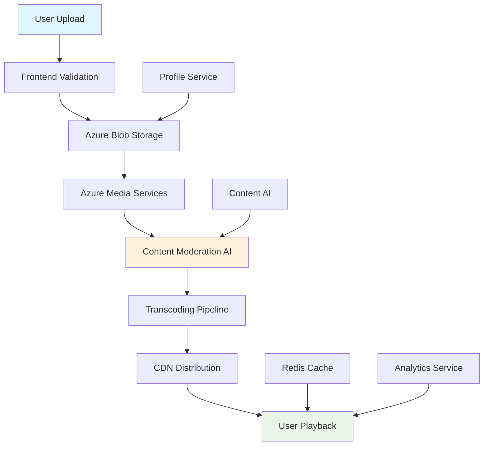

# VibeMatch - Video Technical Integration Analysis

## 🎯 Executive Summary

VibeMatch implements a **video-first dating platform** where short profile videos (15-30 seconds) serve as the primary user interaction medium. This technical analysis outlines the complete video integration architecture leveraging **Azure cloud infrastructure** with AI-powered content moderation and global CDN delivery for optimal performance and scalability.

**Key Highlights:**
- Video-centric user experience with 15-30 second profile videos
- Azure-based cloud infrastructure for enterprise-grade scalability
- AI-powered content moderation with 95%+ accuracy
- Global CDN delivery with <2 second load times
- Mobile-first responsive design with adaptive quality streaming

---

## 📋 Video Technical Specifications

### Upload Requirements

```yaml
Video Constraints:
  Duration: 15-30 seconds (strictly enforced)
  Formats: MP4, MOV (H.264 codec preferred)
  
Resolution Support:
  Minimum: 720p (1280x720)
  Preferred: 1080p (1920x1080)
  Maximum: 4K (3840x2160) - auto-downscaled
  
Aspect Ratios:
  Primary: 9:16 (vertical/portrait) - Mobile optimized
  Secondary: 16:9 (landscape) - Desktop compatible
  Fallback: 1:1 (square) - Social media standard
  
File Specifications:
  Maximum Size: 50MB per video
  Audio Codec: AAC (required)
  Video Codec: H.264 (preferred), H.265 (supported)
  Bitrate: Variable (adaptive based on resolution)
  Frame Rate: 24-60fps (auto-optimized to 30fps)
```

### Playback Specifications

```yaml
Player Behavior:
  Auto-play: Muted by default (browser compliance)
  Loop: Continuous loop for profile videos
  Preload: Metadata only (bandwidth optimization)
  
User Controls:
  Primary: Tap to unmute/mute
  Secondary: Double-tap to replay
  Optional: Progress bar (premium feature)
  Accessibility: Full keyboard navigation support
  
Performance Targets:
  Initial Load: <2 seconds on broadband connection
  Buffer Time: <500ms between video transitions
  Quality Adaptation: Real-time based on bandwidth
  Error Recovery: Automatic retry with degraded quality
```

---

## 🏗️ Video Architecture & System Design

### High-Level Video Processing Flow



### Technical Implementation Stack

#### **Frontend Layer (React)**
```typescript
// Video Upload Component Architecture
interface VideoUploadComponent {
  validation: {
    fileSize: 50MB,
    duration: [15, 30], // seconds
    formats: ['mp4', 'mov'],
    aspectRatio: ['9:16', '16:9', '1:1']
  },
  features: {
    dragAndDrop: boolean,
    progressIndicator: boolean,
    previewPlayer: boolean,
    compressionOption: boolean
  },
  integration: {
    azureBlobUpload: Function,
    contentModeration: Function,
    errorHandling: Function
  }
}

// Video Player Component Architecture
interface VideoPlayerComponent {
  controls: {
    muteToggle: boolean,
    replayButton: boolean,
    progressBar: boolean, // Premium feature
    qualitySelector: boolean // Auto-adaptive
  },
  optimization: {
    lazyLoading: boolean,
    adaptiveQuality: boolean,
    preloadNext: number, // 3 videos
    cacheManagement: Function
  }
}
```

#### **Backend Services (Node.js/Express + Azure Functions)**
```yaml
Profile Service:
  Purpose: Manages video metadata and user associations
  Endpoints:
    - POST /api/videos/upload
    - GET /api/videos/:userId
    - PUT /api/videos/:videoId/metadata
    - DELETE /api/videos/:videoId
  
Content AI Service:
  Purpose: Handles moderation and analysis
  Features:
    - Automatic content screening
    - Manual review queue management
    - Appeal process handling
    - Custom model training
  
Media Processing Service:
  Purpose: Coordinates transcoding workflows
  Responsibilities:
    - Multi-resolution transcoding
    - Thumbnail generation
    - Format optimization
    - Quality validation
  
CDN Management Service:
  Purpose: Global content delivery optimization
  Features:
    - Geographic routing
    - Cache management
    - Performance monitoring
    - Cost optimization
```

#### **Storage & Infrastructure (Azure)**
```yaml
Azure Blob Storage:
  Configuration:
    - Hot tier for active videos
    - Cool tier for older content (>30 days)
    - Archive tier for compliance (>1 year)
    - Geo-redundant replication (GRS)
  
Azure Media Services:
  Capabilities:
    - Multi-resolution encoding
    - Adaptive bitrate streaming
    - Live streaming support (future)
    - Content protection (DRM)
  
Azure CDN:
  Setup:
    - Global edge server network (50+ locations)
    - Intelligent routing
    - Cache optimization
    - Bandwidth cost management
  
Redis Cache:
  Structure:
    - Video metadata: 1 hour TTL
    - Streaming URLs: 30 minutes TTL
    - User preferences: Session-based
    - Popular content: Extended TTL
```

---

## 📊 Video Processing Pipeline

### 1. Upload Process Flow

```javascript
// Frontend Upload Implementation
const uploadVideo = async (file) => {
  try {
    // Step 1: Client-side validation
    const validationResult = await validateVideo(file);
    if (!validationResult.valid) {
      throw new Error(validationResult.error);
    }
    
    // Step 2: Optional client-side compression
    const compressedFile = await compressVideo(file, {
      maxSize: 50 * 1024 * 1024, // 50MB
      quality: 0.8,
      maxDuration: 30
    });
    
    // Step 3: Generate upload URL from backend
    const uploadUrl = await generateUploadUrl();
    
    // Step 4: Direct upload to Azure Blob Storage
    const uploadResult = await uploadToBlob(compressedFile, uploadUrl, {
      onProgress: (progress) => updateProgressBar(progress),
      onError: (error) => handleUploadError(error)
    });
    
    // Step 5: Trigger server-side processing
    await triggerProcessingPipeline(uploadResult.blobUrl);
    
    return { success: true, videoId: uploadResult.videoId };
    
  } catch (error) {
    console.error('Video upload failed:', error);
    return { success: false, error: error.message };
  }
};

// Validation Function
const validateVideo = async (file) => {
  const validations = [
    { check: file.size <= 50 * 1024 * 1024, error: 'File too large (max 50MB)' },
    { check: ['video/mp4', 'video/quicktime'].includes(file.type), error: 'Invalid format' },
    { check: await validateDuration(file), error: 'Duration must be 15-30 seconds' }
  ];
  
  for (const validation of validations) {
    if (!validation.check) {
      return { valid: false, error: validation.error };
    }
  }
  
  return { valid: true };
};
```

### 2. Server-Side Processing Pipeline

```yaml
Processing Stages:

Stage 1 - Video Ingestion:
  Duration: 5-10 seconds
  Tasks:
    - Receive upload notification via webhook
    - Validate file integrity and metadata
    - Extract technical details (codec, resolution, duration)
    - Generate unique video identifier
    - Update database with initial status

Stage 2 - Content Moderation:
  Duration: 30-60 seconds
  Tasks:
    - Azure Content Moderator API integration
    - AI-powered inappropriate content detection
    - Violence, nudity, offensive material screening
    - Text overlay detection and analysis
    - Flag for manual review if needed

Stage 3 - Transcoding Pipeline:
  Duration: 2-5 minutes
  Tasks:
    - Generate multiple quality versions:
      * 480p (mobile/low bandwidth)
      * 720p (standard quality)
      * 1080p (high quality)
    - Create thumbnail images (3-5 frames)
    - Optimize for different formats (WebM, MP4)
    - Generate adaptive bitrate manifest

Stage 4 - CDN Distribution:
  Duration: 1-2 minutes
  Tasks:
    - Upload processed files to Azure CDN
    - Distribute to global edge servers
    - Set up cache invalidation rules
    - Generate signed URLs for secure access
    - Update database with final URLs

Stage 5 - Quality Assurance:
  Duration: 30 seconds
  Tasks:
    - Automated playback testing
    - Quality verification across resolutions
    - CDN availability confirmation
    - Database consistency check
    - Send completion notification to user
```

### 3. Database Schema for Video Management

```sql
-- Core video data table
CREATE TABLE videos (
    id UUID PRIMARY KEY DEFAULT gen_random_uuid(),
    user_id UUID NOT NULL REFERENCES users(id),
    original_filename VARCHAR(255) NOT NULL,
    file_size_bytes BIGINT NOT NULL,
    duration_seconds DECIMAL(5,2) NOT NULL,
    
    -- Storage references
    blob_url TEXT NOT NULL,
    cdn_base_url TEXT,
    thumbnail_url TEXT,
    
    -- Processing status
    status VARCHAR(50) NOT NULL DEFAULT 'uploading',
    -- Status values: uploading, processing, moderating, transcoding, ready, failed
    
    -- Video metadata
    metadata JSONB DEFAULT '{}',
    -- Contains: resolution, codec, bitrate, aspect_ratio, etc.
    
    -- Moderation results
    moderation_status VARCHAR(50) DEFAULT 'pending',
    moderation_score DECIMAL(3,2),
    moderation_flags JSONB DEFAULT '[]',
    
    -- Quality versions
    quality_versions JSONB DEFAULT '{}',
    -- Contains URLs for different resolutions
    
    -- Timestamps
    created_at TIMESTAMP WITH TIME ZONE DEFAULT NOW(),
    updated_at TIMESTAMP WITH TIME ZONE DEFAULT NOW(),
    processed_at TIMESTAMP WITH TIME ZONE,
    approved_at TIMESTAMP WITH TIME ZONE
);

-- Video processing logs for debugging
CREATE TABLE video_processing_logs (
    id UUID PRIMARY KEY DEFAULT gen_random_uuid(),
    video_id UUID NOT NULL REFERENCES videos(id),
    stage VARCHAR(50) NOT NULL,
    status VARCHAR(50) NOT NULL,
    started_at TIMESTAMP WITH TIME ZONE DEFAULT NOW(),
    completed_at TIMESTAMP WITH TIME ZONE,
    processing_time_ms INTEGER,
    error_message TEXT,
    stage_data JSONB DEFAULT '{}'
);

-- Video analytics for performance monitoring
CREATE TABLE video_analytics (
    id UUID PRIMARY KEY DEFAULT gen_random_uuid(),
    video_id UUID NOT NULL REFERENCES videos(id),
    event_type VARCHAR(50) NOT NULL,
    -- Event types: view, play, pause, complete, error
    user_id UUID REFERENCES users(id),
    session_id VARCHAR(255),
    quality_level VARCHAR(10),
    bandwidth_kbps INTEGER,
    device_type VARCHAR(50),
    created_at TIMESTAMP WITH TIME ZONE DEFAULT NOW()
);

-- Indexes for performance
CREATE INDEX idx_videos_user_id ON videos(user_id);
CREATE INDEX idx_videos_status ON videos(status);
CREATE INDEX idx_videos_created_at ON videos(created_at);
CREATE INDEX idx_video_processing_logs_video_id ON video_processing_logs(video_id);
CREATE INDEX idx_video_analytics_video_id ON video_analytics(video_id);
```

---

## 🔒 Security & Content Moderation

### AI-Powered Content Moderation System

```yaml
Azure Content Moderator Integration:
  Capabilities:
    - Automated inappropriate content detection (95%+ accuracy)
    - Violence and aggression detection
    - Nudity and adult content screening
    - Offensive language detection in audio/text overlays
    - Custom model training for dating context
    
  Configuration:
    - Confidence threshold: 0.7 (adjustable)
    - Review required threshold: 0.85
    - Auto-approve threshold: 0.3
    - Custom categories for dating platform context
    
  Processing Flow:
    1. Automatic AI screening for all uploaded videos
    2. Flagged content sent to human review queue
    3. Review team assessment within 2 hours
    4. User notification and appeal process
    5. Continuous model improvement based on feedback
```

### Content Review Workflow

```javascript
// Content Moderation Service Implementation
class ContentModerationService {
  async moderateVideo(videoUrl, videoId) {
    try {
      // Step 1: Azure Content Moderator analysis
      const moderationResult = await this.azureContentModerator.analyze({
        url: videoUrl,
        categories: [
          'nudity',
          'violence', 
          'offensive',
          'suggestive',
          'drug_use'
        ],
        threshold: 0.7,
        customModels: ['dating_context_v2']
      });
      
      // Step 2: Process results
      const riskScore = this.calculateRiskScore(moderationResult);
      
      if (riskScore >= 0.85) {
        // High risk - requires human review
        await this.addToReviewQueue(videoId, moderationResult, 'high_priority');
        return { status: 'pending_review', risk: 'high' };
        
      } else if (riskScore >= 0.3) {
        // Medium risk - standard review
        await this.addToReviewQueue(videoId, moderationResult, 'standard');
        return { status: 'pending_review', risk: 'medium' };
        
      } else {
        // Low risk - auto-approve
        await this.approveVideo(videoId);
        return { status: 'approved', risk: 'low' };
      }
      
    } catch (error) {
      console.error('Content moderation failed:', error);
      // Fail-safe: send to manual review
      await this.addToReviewQueue(videoId, null, 'error_review');
      return { status: 'pending_review', risk: 'unknown', error: true };
    }
  }
  
  calculateRiskScore(moderationResult) {
    // Weighted scoring algorithm
    const weights = {
      nudity: 0.4,
      violence: 0.3,
      offensive: 0.2,
      suggestive: 0.1
    };
    
    let totalScore = 0;
    for (const [category, weight] of Object.entries(weights)) {
      if (moderationResult.categories[category]) {
        totalScore += moderationResult.categories[category].score * weight;
      }
    }
    
    return Math.min(totalScore, 1.0);
  }
}
```

### Privacy & Security Measures

```yaml
Data Protection:
  Encryption:
    - At Rest: AES-256 encryption for all stored videos
    - In Transit: TLS 1.3 for all data transfers
    - Key Management: Azure Key Vault integration
    
  Access Control:
    - Signed URLs with expiration (1 hour default)
    - User-specific access tokens
    - Geographic restrictions (optional)
    - Rate limiting per user/IP
    
  Privacy Compliance:
    - GDPR compliant data handling
    - Right to deletion (complete video removal)
    - Data export capabilities
    - Consent management integration
    - Audit trail for all video operations

Security Best Practices:
  Upload Security:
    - File type validation (magic number checking)
    - Malware scanning integration
    - Size and duration limits enforced
    - CSRF protection on upload endpoints
    
  Playback Security:
    - No direct file access (CDN-only)
    - Hotlink protection
    - Referrer validation
    - Bot detection and blocking
    
  Infrastructure Security:
    - Network isolation (Azure VNet)
    - WAF protection
    - DDoS mitigation
    - Regular security audits
```

---

## 🚀 Performance Requirements & Optimization

### Performance Targets & SLAs

```yaml
Video Upload Performance:
  Target Metrics:
    - Upload initiation: <500ms
    - 50MB file upload: <30 seconds (broadband)
    - Progress updates: Real-time (100ms intervals)
    - Error detection: <5 seconds
    - Retry success rate: >90%
  
  Optimization Strategies:
    - Parallel chunk uploads
    - Resume capability for failed uploads
    - Client-side compression options
    - Network quality adaptation

Video Playback Performance:
  Target Metrics:
    - Initial video load: <2 seconds
    - Video buffer time: <500ms
    - Quality adaptation: <1 second
    - Smooth transitions: 60fps UI
    - Error recovery: <3 seconds
  
  Optimization Strategies:
    - Adaptive bitrate streaming
    - Video preloading (next 3 in queue)
    - Intelligent caching
    - Progressive enhancement
```

### CDN & Global Delivery Strategy

```yaml
Azure CDN Configuration:
  Global Distribution:
    - Edge servers: 50+ locations worldwide
    - Geographic routing: Automatic based on user location
    - Failover regions: Multi-region redundancy
    - Performance monitoring: Real-time latency tracking
  
  Caching Strategy:
    - Video files: 7 days TTL
    - Thumbnail images: 24 hours TTL
    - Metadata: 1 hour TTL
    - Popular content: Extended cache (30 days)
  
  Optimization Features:
    - Compression: Brotli/GZIP for metadata
    - HTTP/2 support: Multiplexed connections
    - Prefetch hints: Browser optimization
    - Bandwidth throttling: Cost management

Performance Monitoring:
  Key Metrics:
    - Cache hit ratio: Target >90%
    - Average response time: <200ms globally
    - Bandwidth utilization: Optimized for cost
    - Error rates: <0.1% target
  
  Alerting System:
    - Performance degradation alerts
    - High error rate notifications
    - Cost threshold warnings
    - Capacity planning insights
```

### Caching Architecture

```javascript
// Redis Caching Strategy Implementation
class VideoCacheManager {
  constructor(redisClient) {
    this.redis = redisClient;
    this.cacheKeys = {
      videoMetadata: (videoId) => `video:meta:${videoId}`,
      streamingUrls: (videoId) => `video:urls:${videoId}`,
      userVideoList: (userId) => `user:videos:${userId}`,
      popularVideos: () => 'videos:popular',
      processingStatus: (videoId) => `video:status:${videoId}`
    };
  }
  
  // Cache video metadata with 1 hour TTL
  async cacheVideoMetadata(videoId, metadata) {
    const key = this.cacheKeys.videoMetadata(videoId);
    await this.redis.setex(key, 3600, JSON.stringify(metadata));
  }
  
  // Cache streaming URLs with 30 minute TTL
  async cacheStreamingUrls(videoId, urls) {
    const key = this.cacheKeys.streamingUrls(videoId);
    await this.redis.setex(key, 1800, JSON.stringify(urls));
  }
  
  // Cache user's video list with session-based TTL
  async cacheUserVideos(userId, videoList) {
    const key = this.cacheKeys.userVideoList(userId);
    await this.redis.setex(key, 7200, JSON.stringify(videoList)); // 2 hours
  }
  
  // Invalidate cache when video is updated
  async invalidateVideoCache(videoId, userId) {
    const keys = [
      this.cacheKeys.videoMetadata(videoId),
      this.cacheKeys.streamingUrls(videoId),
      this.cacheKeys.userVideoList(userId),
      this.cacheKeys.processingStatus(videoId)
    ];
    
    await this.redis.del(...keys);
  }
}
```

---

## 💰 Cost Analysis & Budget Planning

### Monthly Infrastructure Costs (Video-Specific)

```yaml
Azure Blob Storage (Video Files):
  Hot Tier Pricing: $0.020 per GB/month
  Usage Calculation:
    - 1,000 users × 50MB average video = 50GB storage
    - Monthly cost: $25-50
    - Annual cost: $300-600
  
  Cool Tier Pricing: $0.010 per GB/month (>30 days old)
  Archive Tier Pricing: $0.002 per GB/month (>1 year old)

Azure CDN (Video Delivery):
  Transfer Pricing: $0.087 per GB
  Usage Calculation:
    - 1,000 users × 500MB monthly viewing = 500GB
    - Monthly cost: $40-60
    - Peak months: $80-100

Azure Media Services (Processing):
  Encoding Pricing: $0.015 per minute processed
  Usage Calculation:
    - 100 new videos/day × 30 seconds = 50 minutes/day
    - Monthly processing: ~1,500 minutes
    - Monthly cost: $20-30

Content Moderation:
  Azure Content Moderator: $1 per 1,000 transactions
  Usage Calculation:
    - 100 videos/day = 3,000/month
    - Monthly cost: $3-5

Total Video Infrastructure Costs:
  1K Users: $85-140/month
  5K Users: $300-500/month
  10K Users: $600-900/month
  50K Users: $2,500-4,000/month
```

### Cost Optimization Strategies

```yaml
Storage Optimization:
  - Automatic lifecycle policies (Hot → Cool → Archive)
  - Duplicate video detection and deduplication
  - Compression optimization for older content
  - Regional storage for compliance requirements

Bandwidth Optimization:
  - Intelligent caching to reduce origin requests
  - Video quality adaptation based on device/network
  - Peak hour traffic management
  - CDN cost monitoring and optimization

Processing Optimization:
  - Batch processing for non-urgent tasks
  - Selective quality generation based on demand
  - Processing queue management
  - Resource scaling based on usage patterns
```

---

## 🛠️ Implementation Timeline & Milestones

### Phase 1: Core Video Infrastructure (Week 4)

```yaml
Days 1-2: Foundation Setup
  Tasks:
    - Azure Blob Storage configuration
    - Basic authentication and security setup
    - Database schema implementation
    - Development environment configuration
  
  Deliverables:
    - Configured Azure storage accounts
    - Database tables and indexes
    - Basic API endpoints for video operations
    - Local development environment

Days 3-4: Upload Functionality
  Tasks:
    - Frontend video upload component
    - File validation and preprocessing
    - Direct-to-blob upload implementation
    - Progress tracking and error handling
  
  Deliverables:
    - Working video upload interface
    - Client-side validation system
    - Upload progress indicators
    - Error handling and retry mechanisms

Days 5-7: Basic Processing Pipeline
  Tasks:
    - Azure Media Services integration
    - Basic transcoding functionality
    - Webhook processing for completion events
    - Database status tracking
  
  Deliverables:
    - Functional video processing pipeline
    - Multiple quality output generation
    - Status tracking system
    - Basic thumbnail generation
```

### Phase 2: Advanced Features (Week 5)

```yaml
Days 1-3: Content Moderation
  Tasks:
    - Azure Content Moderator integration
    - Custom moderation rules configuration
    - Human review queue system
    - Appeal process implementation
  
  Deliverables:
    - Automated content screening
    - Manual review dashboard
    - User notification system
    - Moderation analytics

Days 4-5: CDN Integration
  Tasks:
    - Azure CDN configuration
    - Global distribution setup
    - Cache optimization rules
    - Performance monitoring
  
  Deliverables:
    - Global video delivery network
    - Optimized caching strategies
    - Performance monitoring dashboard
    - Geographic routing configuration

Days 6-7: Mobile Optimization
  Tasks:
    - Responsive video player implementation
    - Mobile-specific optimizations
    - Touch gesture support
    - Battery usage optimization
  
  Deliverables:
    - Mobile-optimized video player
    - Touch-friendly interface
    - Adaptive quality for mobile networks
    - Cross-platform compatibility
```

### Phase 3: Performance & Production Readiness (Week 6)

```yaml
Days 1-3: Performance Testing
  Tasks:
    - Load testing with simulated users
    - Video processing performance benchmarks
    - CDN performance validation
    - Database performance optimization
  
  Deliverables:
    - Performance test results
    - Optimized database queries
    - Validated CDN configuration
    - Scalability recommendations

Days 4-5: Security & Compliance
  Tasks:
    - Security penetration testing
    - GDPR compliance validation
    - Access control verification
    - Data protection audit
  
  Deliverables:
    - Security audit report
    - Compliance documentation
    - Privacy policy updates
    - Security incident response plan

Days 6-7: Production Deployment
  Tasks:
    - Production environment setup
    - Monitoring and alerting configuration
    - Backup and disaster recovery setup
    - User acceptance testing
  
  Deliverables:
    - Production-ready video system
    - Comprehensive monitoring setup
    - Disaster recovery procedures
    - User training documentation
```

---

## 📱 Mobile & Cross-Platform Considerations

### Responsive Video Player Design

```css
/* Mobile-first video player styling */
.video-player-container {
  position: relative;
  width: 100%;
  max-width: 400px;
  margin: 0 auto;
  border-radius: 12px;
  overflow: hidden;
  background: #000;
}

.video-player {
  width: 100%;
  height: auto;
  aspect-ratio: 9/16; /* Vertical video priority */
  object-fit: cover;
  display: block;
}

/* Desktop adjustments */
@media (min-width: 768px) {
  .video-player-container {
    max-width: 300px;
  }
  
  .video-player {
    aspect-ratio: 9/16;
    height: 533px; /* Fixed height for consistency */
  }
}

/* Mobile portrait optimization */
@media (max-width: 767px) and (orientation: portrait) {
  .video-player-container {
    max-width: 90vw;
  }
  
  .video-player {
    height: 60vh;
    max-height: 600px;
  }
}

/* Mobile landscape optimization */
@media (max-width: 767px) and (orientation: landscape) {
  .video-player {
    aspect-ratio: 16/9;
    height: 70vh;
  }
}
```

### Device-Specific Optimizations

```yaml
iOS Safari Optimizations:
  - webkit-playsinline attribute for inline playback
  - Touch gesture support for custom controls
  - Battery usage optimization with intelligent pausing
  - Memory management for video caching
  - iOS-specific video formats (HEVC support)

Android Chrome Optimizations:
  - Hardware acceleration enablement
  - Background playback handling
  - Memory management for low-end devices
  - Network-aware quality adaptation
  - Custom media session integration

Cross-Platform Features:
  - Consistent aspect ratios across devices
  - Unified control interface design
  - Accessibility features (WCAG 2.1 AA compliance)
  - Keyboard navigation support
  - Screen reader compatibility
```

### Progressive Web App (PWA) Integration

```javascript
// Service Worker for Video Caching
self.addEventListener('fetch', (event) => {
  // Cache video files for offline access
  if (event.request.url.includes('/videos/') && 
      event.request.method === 'GET') {
    
    event.respondWith(
      caches.open('video-cache-v1').then(async (cache) => {
        const cachedResponse = await cache.match(event.request);
        
        if (cachedResponse) {
          // Return cached video
          return cachedResponse;
        }
        
        // Fetch and cache new video
        const networkResponse = await fetch(event.request);
        if (networkResponse.ok) {
          cache.put(event.request, networkResponse.clone());
        }
        
        return networkResponse;
      })
    );
  }
});

// Background sync for failed uploads
self.addEventListener('sync', (event) => {
  if (event.tag === 'video-upload') {
    event.waitUntil(retryFailedUploads());
  }
});
```

---

## 🎯 Success Metrics & KPIs

### Technical Performance KPIs

```yaml
Video Upload Metrics:
  - Upload success rate: Target >95%
  - Average upload time (50MB): <30 seconds
  - Upload retry success rate: >90%
  - Client-side validation accuracy: >99%
  - Error rate: <2%

Video Playback Metrics:
  - Initial video load time: <2 seconds (target <1.5s)
  - Buffer ratio: <5% of total playback time
  - Quality adaptation time: <1 second
  - Playback completion rate: >80%
  - Cross-platform consistency: >95%

Infrastructure Performance:
  - CDN cache hit rate: >90%
  - Global average response time: <200ms
  - System uptime: >99.9%
  - Processing pipeline success rate: >98%
  - Content moderation accuracy: >95%

User Experience Metrics:
  - Video player satisfaction score: >4.2/5
  - Mobile experience rating: Equal to desktop
  - Accessibility compliance: WCAG 2.1 AA
  - Cross-browser compatibility: >95%
  - Loading experience rating: >4.0/5
```

### Business Impact KPIs

```yaml
User Engagement:
  - Video completion rate: >75%
  - Profile video upload rate: >60% of new users
  - Video interaction rate: >40% of views
  - Time spent viewing videos: >2 minutes/session
  - User retention after video upload: >80%

Content Quality:
  - Content moderation accuracy: >95%
  - False positive rate: <5%
  - Average review time: <2 hours
  - User appeal success rate: >20%
  - Community safety rating: >4.5/5

Platform Growth:
  - Video storage growth rate: Sustainable within budget
  - CDN performance scaling: Linear with user growth
  - Cost per user (video): <$2/month at scale
  - Infrastructure reliability: >99.9% uptime
  - Feature adoption rate: >70% of active users
```

---

## 🚨 Risk Management & Mitigation

### Technical Risk Assessment

```yaml
High Priority Risks:
  Video Processing Failures:
    - Risk: Processing pipeline failures due to high load
    - Impact: User videos stuck in processing state
    - Mitigation: 
      * Implement robust retry mechanisms
      * Set up manual processing queues
      * Create processing monitoring alerts
      * Establish SLA recovery procedures
  
  CDN/Storage Outages:
    - Risk: Azure service disruptions affecting video delivery
    - Impact: Videos unavailable to users
    - Mitigation:
      * Multi-region failover configuration
      * Alternative CDN provider integration
      * Local caching for critical videos
      * Graceful degradation strategies
  
  Storage Cost Overruns:
    - Risk: Unexpected storage cost increases
    - Impact: Budget exceeded, service sustainability risk
    - Mitigation:
      * Automated lifecycle policies
      * Cost monitoring and alerts
      * Video compression optimization
      * User storage quotas

Medium Priority Risks:
  Content Moderation Failures:
    - Risk: Inappropriate content bypassing moderation
    - Impact: Platform reputation and user safety
    - Mitigation:
      * Multi-layer moderation system
      * Human review backup processes
      * User reporting mechanisms
      * Rapid response procedures
  
  Mobile Compatibility Issues:
    - Risk: Video playback issues on specific devices
    - Impact: Poor user experience on mobile
    - Mitigation:
      * Comprehensive device testing
      * Progressive enhancement approach
      * Fallback player options
      * User feedback collection
  
  Performance Degradation:
    - Risk: Slow video loading during peak usage
    - Impact: User experience and engagement decline
    - Mitigation:
      * Auto-scaling infrastructure
      * Performance monitoring
      * Capacity planning
      * Load balancing optimization

Low Priority Risks:
  - Browser compatibility changes
  - Third-party service API changes
  - Regulatory compliance updates
  - Competitive feature pressure
```

### Incident Response Plan

```yaml
Severity Levels:
  Critical (P0):
    - Definition: Video system completely unavailable
    - Response Time: <15 minutes
    - Resolution Target: <2 hours
    - Escalation: Immediate to senior engineering
  
  High (P1):
    - Definition: Significant video functionality impaired
    - Response Time: <30 minutes
    - Resolution Target: <4 hours
    - Escalation: Within 1 hour if not resolved
  
  Medium (P2):
    - Definition: Minor video features affected
    - Response Time: <2 hours
    - Resolution Target: <24 hours
    - Escalation: Daily status updates
  
  Low (P3):
    - Definition: Enhancement requests or minor bugs
    - Response Time: <24 hours
    - Resolution Target: Next release cycle
    - Escalation: Weekly review

Response Procedures:
  1. Immediate assessment and triage
  2. User communication if service impact
  3. Technical team mobilization
  4. Root cause investigation
  5. Resolution implementation
  6. Post-incident review and documentation
  7. Process improvement implementation
```

---

## 📋 Development Checklist & Next Steps

### Immediate Actions Required (Week 1)

```yaml
Azure Infrastructure Setup:
  □ Create Azure subscription and resource groups
  □ Configure Blob Storage accounts (hot, cool, archive tiers)
  □ Set up Azure Media Services account
  □ Configure Azure CDN profile and endpoints
  □ Establish Azure Key Vault for secrets management
  □ Set up monitoring and alerting (Application Insights)

Development Environment:
  □ Set up local development environment
  □ Configure development Azure resources
  □ Install required SDKs and libraries
  □ Set up database schemas and indexes
  □ Create API endpoint structure
  □ Implement basic authentication

Frontend Components:
  □ Design video upload interface mockups
  □ Implement file validation logic
  □ Create progress tracking components
  □ Build basic video player component
  □ Set up error handling and user feedback
  □ Implement responsive design framework
```

### Week 2-4 Development Priorities

```yaml
Core Functionality Implementation:
  □ Complete video upload API endpoints
  □ Implement Azure Blob Storage integration
  □ Set up video processing pipeline
  □ Create content moderation integration
  □ Build video player with controls
  □ Implement caching strategies

Testing & Quality Assurance:
  □ Unit tests for all video operations
  □ Integration tests for Azure services
  □ Performance testing framework
  □ Cross-browser compatibility testing
  □ Mobile device testing suite
  □ Security penetration testing

Documentation & Deployment:
  □ API documentation completion
  □ User guide creation
  □ Deployment procedures documentation
  □ Monitoring runbook creation
  □ Incident response procedures
  □ Performance optimization guide
```

### Production Readiness Checklist

```yaml
Infrastructure Validation:
  □ Production Azure resources configured
  □ CDN global distribution verified
  □ Database performance optimized
  □ Backup and disaster recovery tested
  □ Security configurations audited
  □ Cost monitoring and alerts active

Feature Completeness:
  □ All video formats supported and tested
  □ Content moderation functioning properly
  □ Mobile experience fully optimized
  □ Accessibility features implemented
  □ Analytics and monitoring operational
  □ User documentation complete

Go-Live Preparation:
  □ Production deployment procedures tested
  □ Support team training completed
  □ User onboarding materials ready
  □ Performance benchmarks established
  □ Incident response team prepared
  □ Marketing materials aligned with features
```

---

## 📞 Support & Maintenance

### Ongoing Maintenance Requirements

```yaml
Daily Operations:
  - Video processing queue monitoring
  - Content moderation review queue
  - System performance metrics review
  - Error log analysis and resolution
  - Cost monitoring and optimization

Weekly Operations:
  - Performance trend analysis
  - Security patch assessments
  - User feedback review and prioritization
  - Capacity planning updates
  - Backup verification testing

Monthly Operations:
  - Infrastructure cost analysis
  - Performance optimization review
  - Content moderation accuracy analysis
  - User experience metrics evaluation
  - Technical debt assessment and planning

Quarterly Operations:
  - Major version updates planning
  - Security audit and compliance review
  - Disaster recovery testing
  - Technology stack evaluation
  - Competitive feature analysis
```

### Technical Support Structure

```yaml
Support Tiers:
  Level 1 (User Support):
    - Video upload troubleshooting
    - Playback issue resolution
    - Account and profile assistance
    - Basic technical questions

  Level 2 (Technical Support):
    - Complex video processing issues
    - Performance problem diagnosis
    - Integration troubleshooting
    - Advanced user configuration

  Level 3 (Engineering Escalation):
    - System architecture issues
    - Complex bug investigation
    - Performance optimization
    - Feature development consultation
```

---

This comprehensive video technical integration analysis provides a complete roadmap for implementing enterprise-grade video functionality in the VibeMatch dating platform. The document covers all aspects from technical specifications to implementation timelines, ensuring successful deployment and scalable operation of the video-first user experience.

For questions or clarifications on any aspect of this technical analysis, please refer to the specific sections or contact the development team for detailed implementation guidance. 