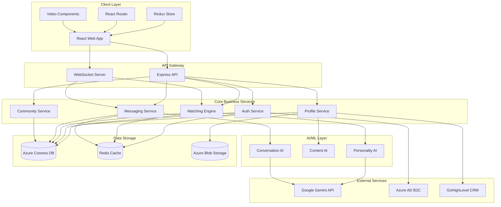

# VibeMatch - System Architecture Overview

## Architecture Components

### Client Layer

- **React Web App**: Main user interface
- **Redux Store**: State management
- **React Router**: Navigation
- **Video Components**: Video profile handling

### API Gateway

- **Express API**: REST API endpoints
- **WebSocket Server**: Real-time communication

### Core Business Services

- **Auth Service**: User authentication and authorization
- **Profile Service**: User profile management
- **Matching Engine**: Compatibility algorithm and matching logic
- **Messaging Service**: Chat and communication features
- **Community Service**: Community platform features

### AI/ML Layer

- **Personality AI**: Quiz analysis and personality type classification
- **Content AI**: Video and text content moderation
- **Conversation AI**: Icebreaker generation and chat suggestions

### Data Storage

- **Azure Cosmos DB**: Primary database for all user data
- **Redis Cache**: Session data and real-time caching
- **Azure Blob Storage**: Video and media file storage

### External Services

- **Google Gemini API**: AI processing and analysis
- **Azure AD B2C**: Identity management
- **GoHighLevel CRM**: Lead management and user lifecycle
